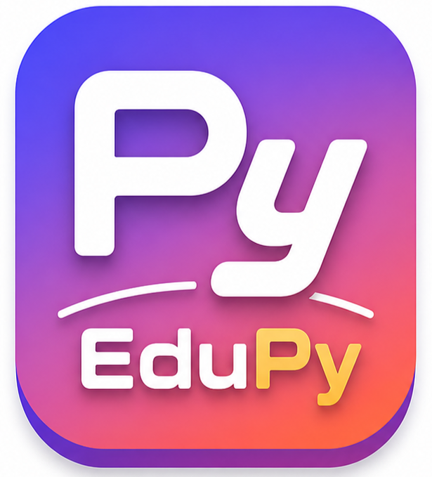

# 🐍 EduPy – Python Practice Playground

<p align="center">
  
</p>

<p align="center">
  <b>Learn Python the Smart Way 🚀</b><br/>
  Interactive Python-like IDE built using JavaScript
</p>

---

## 🌟 Overview

**EduPy** is a browser-based Python learning platform designed for beginners.
It provides a **real-time coding environment**, **visual execution**, and **interactive learning tools** — all in one place.

This project simulates a Python-like language using a custom-built interpreter written in JavaScript.

---

## ⚡ Features

✨ Code Editor (CodeMirror)
✨ Python-like Syntax Support
✨ AST (Abstract Syntax Tree) Viewer
✨ Real-time Code Execution
✨ Built-in Notes (English + Hinglish)
✨ Practice Assessments (60+ Questions)
✨ Mini Projects (Calculator, Guess Game, To-Do)
✨ Clean UI + Responsive Design

---

## 🧠 Core Engine

EduPy includes a custom interpreter with:

* 🔤 Lexer (Tokenization)
* 🧩 Parser (Syntax Analysis)
* ⚙️ Interpreter (Execution Engine)

Advanced Support:

* Variables & Expressions
* If-Else, Loops
* Functions & Classes
* f-Strings & Multi-line Strings
* Python-like Built-ins

👉 Main logic: `main.js` 

---

## 📁 Project Structure

```
EduPy/
│── index.html        # Main Playground
│── home.html         # Landing Page
│── projects.html     # Mini Projects
│── notes.html        # Python Notes
│── assessments.html  # Practice Questions
│── style.css         # UI Styling
│── main.js           # Interpreter Engine
│── edupy-stdlib.js   # Built-in Functions
│── logo.png          # Project Logo
│── README.md         # Documentation
```

---

## 🖥️ How to Run

### 👉 Option 1: Direct Run

Just open:

```
index.html
```

in your browser

---

### 👉 Option 2: VS Code (Recommended)

1. Open project folder in VS Code
2. Install **Live Server Extension**
3. Right-click → `Open with Live Server`

---

## 🎮 Example Code

```python
x = 10
if x > 5:
    print("Hello EduPy 🚀")
```

---

## 🧪 Practice Modules

* 📘 Notes (Beginner → Advanced)
* 📝 Assessments (Level-wise)
* 💻 Mini Projects:

  * Calculator
  * Guess Game
  * To-Do App

---

## 🛠️ Tech Stack

* HTML5
* CSS3
* JavaScript
* CodeMirror Editor

---

## 📌 Future Improvements

* Debugger + Variable Inspector
* File Save / Load Feature
* Online Hosting + Domain
* More Python Libraries Support

---

## 👨‍💻 Author

**Mohammed Shadab**
B.Tech CSE Student

---

## ⭐ Support

If you like this project:

👉 Star the repo
👉 Share with friends
👉 Contribute improvements

---

## 💡 Inspiration

Built to make Python learning:

> Simple, Visual, and Fun 🎯

---
"# EDUPY" 
