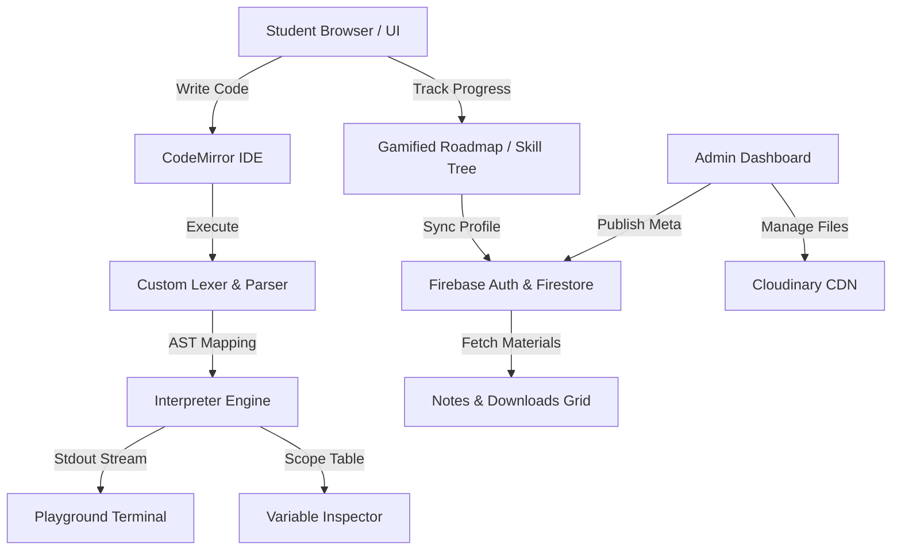

# 🐍 EduPy — Visual Python Learning Platform & Interactive IDE

<p align="center">
  
</p>

<p align="center">
  <b>Learn Python the Smart Way 🚀</b><br/>
  Interactive visual playground, custom client-side Python interpreter, and gamified roadmap.
</p>

---

## 📖 Table of Contents
1. [Overview & Core Philosophy](#-overview--core-philosophy)
2. [Architectural Overview](#-architectural-overview)
3. [The Custom Python Interpreter Engine](#-the-custom-python-interpreter-engine)
4. [Functional Feature Suite](#-functional-feature-suite)
5. [Tech Stack & Dependencies](#-tech-stack--dependencies)
6. [Directory Structure](#-directory-structure)
7. [Database Schema & Data Models](#-database-schema--data-models)
8. [Security & Access Control Rules](#-security--access-control-rules)
9. [Installation & Setup Guide](#-installation--setup-guide)
10. [Future Enhancements & Contributions](#-future-enhancements--contributions)

---

## 🌟 Overview & Core Philosophy

**EduPy** is a browser-based visual learning environment designed to bridge the gap between abstract programming syntax and concrete mental models. Beginners often struggle with visualising execution control flows, variable states, and call stacks. EduPy solves this by offering:
- **Line-by-Line Code Tracing**: Live visualizer showing exactly which line is running and what it does.
- **Abstract Syntax Tree (AST) Inspection**: Helping students understand how source code is tokenized and structured by computers.
- **Gamified Roadmap & Orbiting Skill Tree**: A highly stylized, responsive space-themed dashboard providing instant visual progression feedbacks.
- **Zero-Install Interpreter**: Runs a subset of Python natively in the browser without compilers or local setups.

---

## 📐 Architectural Overview

EduPy operates entirely serverless, relying on robust client-side compiler routines, Firestore backend syncing, and external static CDNs.



---

## 🧠 The Custom Python Interpreter Engine

The core runtime of EduPy is written from scratch in [main.js](file:///c:/Users/VICTUS/OneDrive/Documents/VS%20CODE%20PROJECTS/EDUPY/main.js) and consists of three distinct compilation phases:

### 1. The Lexer (Tokenization)
- **Indentation Resolution**: Implements a stateful indent stack. When line indent levels change, the lexer pushes to the stack and emits `INDENT` or `DEDENT` tokens, mirroring Python's white-space block parser.
- **String Preprocessor**: Correctly handles triple-quoted multiline comments (`"""` and `'''`) and parses dynamic `f-strings` into expressions.
- **Nesting Tracking**: Tracks parentheses, brackets, and braces nesting depth. Newlines inside active nested scopes are filtered out to support multi-line declarations.

### 2. The Parser (AST Generation)
- Parses the stream of tokens into a structured JSON representation of the Abstract Syntax Tree (AST).
- Supports parsing variables, control structures (`if-elif-else`, `while`, `for`), functions, classes, walrus assignment (`:=`), lambda expressions, context managers (`with`), and tuple unpacking.

### 3. The Interpreter (Execution Engine)
- Recursively evaluates AST nodes.
- Manages standard scoping (Local, Enclosing, Global, Builtin) and resolves namespaces dynamically.
- Implements basic Object-Oriented Programming (OOP) properties like instantiation (`__init__`) and standard `self` binding.
- Houses a modular standard library in [edupy-stdlib.js](file:///c:/Users/VICTUS/OneDrive/Documents/VS%20CODE%20PROJECTS/EDUPY/edupy-stdlib.js) mimicking core Python functions (`enumerate`, `zip`, `map`, `filter`, `sorted`, etc.).

---

## ⚡ Functional Feature Suite

### 💻 Code Playground
- **IDE Interface**: Integrates CodeMirror with Monokai styling and Python key mappings.
- **AST Inspector**: Real-time modal showing code block breakdown nodes.
- **Dynamic Scope Variables Inspector**: Table view revealing currently loaded variables, types, and values in active memory.

### 🌌 Visual Learning Roadmap & Skill Tree
- **Starry Space Theme**: Custom animated SVG background featuring gas nebulas, twinkling stars, and neon vector paths.
- **Interactive Orbit Nodes**: Completed course levels glow gold and spin outer rings; active nodes run loop animations guiding students forward.
- **Fully Responsive Scaling**: Swaps layout structures seamlessly depending on screen size:
  - **Desktop**: Horizontal winding curve.
  - **Tablet**: Winding spiral curve.
  - **Mobile**: Vertical zigzag layout using a sliding glassmorphic details sheet that locks at the bottom of the screen.

### 🎬 Projects Visualizer
- Visualizes the execution steps of default programs (Guessing Game, Calculator, Todo List) line-by-line.
- Highlight lines, output simulator logs, and concept cards side-by-side.

### 🧩 Drag-and-Drop Parsons Puzzles
- Practice code logic block alignment. Drag and drop lines of Python scripts to sort them in order, with instant code checking and validation.

### 📁 Study Materials System
- Direct file uploads from the Admin page to Cloudinary buckets.
- Auto-catalog files into Firestore collections.
- Category-wise downloads card layout under student Notes view.

---

## 🛠️ Tech Stack & Dependencies

- **Frontend**: HTML5, CSS3 (Vanilla design, glassmorphic styles, custom grids), ES6+ JavaScript.
- **Core Editor**: [CodeMirror 5](https://codemirror.net/) (with python-mode syntax & monokai theme).
- **Backend-as-a-Service**: [Firebase](https://firebase.google.com/) (Compat v10 for Auth & Firestore).
- **Cloud Hosting & CDN**: [Cloudinary](https://cloudinary.com/) (Administrative assets bucket).
- **Libraries**:
  - `canvas-confetti` (Completion feedback animations)
  - `Font Awesome` (Icons package)
  - `Chart.js` (Student dashboard activity stats charts)

---

## 📂 Directory Structure

```
EDUPY/
│── index.html          # Interactive Code Playground & IDE Workspace
│── home.html           # Landing Page introducing the project
│── dashboard.html      # Gamified Learning Roadmap & Skill Tree
│── notes.html          # Study Notes & Downloadable PDF grids
│── projects.html       # Python Projects line-by-line visualizer
│── assessments.html    # Multiple choice quizzes sorted by level
│── puzzles.html        # Drag-and-Drop Parsons Problems code builder
│── certificate.html    # Student certification generation and validation
│── admin.html          # Admin Panel: user control, file uploads, puzzle seeding
│── main.js             # Compiler: Lexer, AST Parser, and Interpreter core
│── edupy-stdlib.js     # Standard library mocking Python built-ins
│── firebase-config.js  # Firebase configuration loader and routing guards
│── style.css           # Global layouts, typography, and styling variables
│── firestore.rules     # Database security and user permission guidelines
│── logo.png            # EduPy official branding logo
│── README.md           # Project documentation and engineering manual
```

---

## 📊 Database Schema & Data Models

All collection models are stored in Google Cloud Firestore:

### 1. `/users/{userId}`
Stores user progress, XP, profile settings, and credentials.
```json
{
  "name": "Alex Mercer",
  "email": "alex@edupy.org",
  "role": "student",          // student | admin
  "level": 3,
  "xp": 350,
  "streak": 5,
  "lastLogin": "Timestamp",
  "badges": ["Loop Master", "First Class"],
  "scores": {
    "beginner_assessment": 85,
    "puzzles_basics": 100
  },
  "projects": {
    "guess": true,
    "calc": false
  }
}
```

### 2. `/study_materials/{materialId}`
Study guides catalogued by administrative uploads.
```json
{
  "title": "Introduction to Object-Oriented Programming",
  "category": "oops",        // basics | control_flow | functions | oops
  "description": "Exhaustive PDF manual covering classes, self binding, objects, and inheritance.",
  "fileUrl": "https://res.cloudinary.com/demo/image/upload/v1234/oop_guide.pdf",
  "fileName": "oop_guide.pdf",
  "fileSize": "1.2 MB",
  "uploadedAt": "Timestamp"
}
```

### 3. `/puzzles/{puzzleId}`
Drag-and-drop Parsons problems configuration.
```json
{
  "title": "Reverse a List",
  "desc": "Drag the blocks of code to construct a function that reverses a list.",
  "correctOrder": [
    "def reverse_list(arr):",
    "    left, right = 0, len(arr) - 1",
    "    while left < right:",
    "        arr[left], arr[right] = arr[right], arr[left]",
    "        left += 1",
    "        right -= 1",
    "    return arr"
  ],
  "distractors": [
    "    while left <= right:",
    "        arr[left] = arr[right]"
  ],
  "hint": "Use a double-pointer swapping approach.",
  "xpReward": 30,
  "createdAt": "Timestamp"
}
```

### 4. `/certificates/{certId}`
Generated completion certificates verifying authenticity.
```json
{
  "serialNumber": "EP-9A2K7",
  "uid": "USER_ID_HEX",
  "name": "Alex Mercer",
  "score": 92,
  "date": "Timestamp",
  "course": "Python Core Foundations"
}
```

---

## 🔒 Security & Access Control Rules

Firestore records are protected by rules defined in [firestore.rules](file:///c:/Users/VICTUS/OneDrive/Documents/VS%20CODE%20PROJECTS/EDUPY/firestore.rules). 

- **Users Collection**: Users can read all profile records when logged in. Writing is restricted to the owner of the document or accounts matching the `admin` role.
- **Course Assets (Questions, Puzzles, Projects, Study Materials)**: Read access is public to allow anonymous preview components. Write operations (create, update, delete) are strictly locked to validated `admin` users.
- **Certificates**: Authenticated users can generate certificates. Modifications or deletes require ownership or administrator authorization.

---

## 🚀 Installation & Setup Guide

### 📦 Local Installation
1. **Clone the Folder**: Open the project folder in VS Code.
2. **Launch server**: Right-click `index.html` and select **Open with Live Server** (ensures router paths and local storage configs initialize properly).

### ⚙️ Database Configuration
To hook the project to your own Firebase and Cloudinary storage instance, update the fallback variables:

1. **Firebase**: Modify `LOCAL_FALLBACK` inside [firebase-config.js](file:///c:/Users/VICTUS/OneDrive/Documents/VS%20CODE%20PROJECTS/EDUPY/firebase-config.js#L6-L13):
   ```javascript
   const LOCAL_FALLBACK = {
     apiKey: "YOUR_API_KEY",
     authDomain: "YOUR_PROJECT.firebaseapp.com",
     projectId: "YOUR_PROJECT_ID",
     storageBucket: "YOUR_PROJECT.appspot.com",
     messagingSenderId: "YOUR_SENDER_ID",
     appId: "YOUR_APP_ID"
   };
   ```
2. **Cloudinary**: Ensure your Cloudinary Upload Preset is configured in the Admin Panel settings overlay inside `admin.html` to support administrative PDF uploads.

---

## 📌 Future Enhancements & Contributions

We welcome optimizations for the EduPy playground. Areas of current development include:
- **Visual Call Stack**: Graphic stack-frame visualizer representing memory pointers.
- **Extended Stdlib Parsing**: Support for math, random, and time sub-modules directly in code scopes.
- **Sandbox Code Execution**: Optional execution execution sandbox supporting python package integration.
- **File Management**: Direct saving and loading of Python scripts to client systems.

*Developed with 💖 to make coding visual and simple.*
